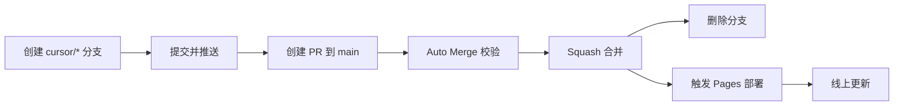

# AI Agent 工作流

本项目由 AI 全权维护。代码变更通过 PR 自动合并并部署到 GitHub Pages，**无需人工合并或部署**。

线上地址：https://jk9988610.github.io/Shoot/

## 自动化流水线

典型耗时：合并约 12 秒，部署约 30–40 秒。

## 认证（已配置）

| Secret | 位置 | 用途 |
|--------|------|------|
| `GITHUB_ADMIN_PAT` | [Cursor Secrets](https://cursor.com/dashboard/cloud-agents) | Agent 沙箱内 `gh` / `git` 认证 |
| `GH_PAT` | GitHub Actions Secrets | 工作流内合并 PR、触发部署 |

环境启动时 `.cursor/environment.json` 会自动执行 `gh auth login`。

### PAT 所需权限（Fine-grained）

对 `Shoot` 仓库，以下权限均为 **Read and write**：

- Contents、Pull requests、Actions、Workflows
- Administration、Issues、Pages

## Agent 操作步骤

1. 从 `main` 创建分支：`cursor/<描述>-e126`
2. 实现功能，**同步更新版本号**（见下方）
3. 提交并推送：`git push -u origin <branch>`
4. 创建 PR：`gh pr create --base main --head <branch> --title "..." --body "..."`
5. **停止** — 不要手动 `gh pr merge`，等待自动合并与部署

### 版本号规范

每次功能变更需同步修改三处：

| 文件 | 字段 |
|------|------|
| `js/version.js` | `VERSION`、`BUILD_LABEL` |
| `index.html` | `window.__BOOT_VERSION__` |
| `bow-editor.html` | `window.__BOOT_VERSION__` |

PR 标题建议包含版本号，例如：`feat: 等腰梯形弓身 (v0.6.4)`

## 自动合并条件

`Auto Merge AI PRs` 工作流在以下全部满足时自动合并：

- 分支名以 `cursor/` 开头
- PR 目标为 `main`
- 必需文件存在：`index.html`、`bow-editor.html`、`js/main.js`、`js/version.js`
- 三处版本号一致
- Draft PR 会先被自动标记为 Ready

## 部署

`Deploy to GitHub Pages` 在以下时机触发：

- **主要**：`auto-merge` 合并成功后 `workflow_dispatch`
- **备用**：直接 `push` 到 `main`

并发部署使用 `cancel-in-progress`，同时只保留最新一次部署。

## 禁止事项

- ❌ 不要手动合并 PR
- ❌ 不要直接 push 到 `main`（应走 PR 流程）
- ❌ 不要删除或禁用 `auto-merge.yml` / `deploy-pages.yml`
- ❌ 不要在仓库中提交 token 或 secret

## 工作流文件

| 文件 | 职责 |
|------|------|
| `.github/workflows/auto-merge.yml` | 校验 → 合并 → 触发部署 |
| `.github/workflows/deploy-pages.yml` | 构建静态站点并发布到 Pages |
| `.cursor/environment.json` | Agent 启动时 PAT 认证 |

## 仓库设置（已配置）

- ✅ Automatically delete head branches
- ✅ Allow auto-merge
- ✅ Actions 读写权限
- ✅ Workflow 默认读写权限

## 故障排查

| 现象 | 处理 |
|------|------|
| PR 未自动合并 | 检查分支是否 `cursor/` 前缀、版本号是否一致 |
| 合并后未部署 | 查看 Actions 中 `Deploy to GitHub Pages` 的 workflow_dispatch 运行 |
| `gh pr create` 403 | 检查 Cursor Secrets 中 `GITHUB_ADMIN_PAT` 是否有效 |
| 线上版本未更新 | 确认 `__BOOT_VERSION__` 与 `js/version.js` 已同步递增 |
