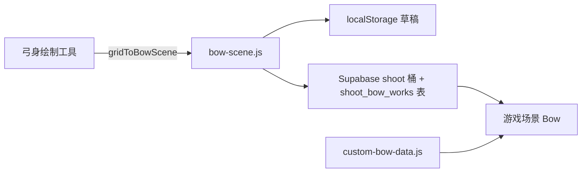

# Supabase — 弓身云端存储 (Shoot)

与 [Card-World](https://github.com/jk9988610/Card-World) 共用同一 Supabase 项目与 `cloud-config` 凭证。

## 初始化步骤

1. **Dashboard → Storage → New bucket**
   - Name: `shoot`
   - Public bucket: **ON**

2. **SQL Editor** 运行：`supabase/schema-shoot-bow.sql`

3. 打开弓身绘制工具 → 点 **☁ 云端开** → 输入昵称 → 绘制弓身

## 数据流（参照 Card-World art-storage）

## 共享格式 `js/bow-scene.js`

| 模块 | 用途 |
|------|------|
| `bow-scene.js` | 绘制工具 ↔ 游戏唯一数据格式 |
| `bow-cloud.js` | 云端草稿 / 发布 / 画廊 |
| `bow-resolve.js` | 解析优先级：云端 active → 本地推送 → 内置 |

## kind 字段

| kind | 含义 |
|------|------|
| `draft` | 编辑器自动保存草稿（按昵称一条） |
| `active` | 当前用于游戏的弓身 |
| `published` | 历史发布归档 |

## 游戏加载

开启云同步（与 Card-World 共用 `cardworld_cloud_opt_in`）后，游戏启动会拉取 `active` 弓身。

未开启时使用内置 `custom-bow-data.js` 或本地推送。
